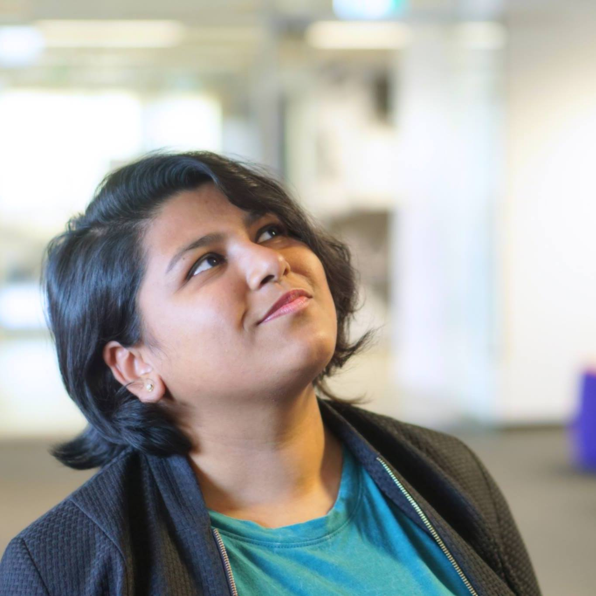

I'm a penultimate year student at University of New South Wales and I'm studying Mechanical Engineering.

I'm a young globetrotter.
I was born in India and finished high school in Bahrain. I've since lived in Canada, Sweden and now Australia in addition to many countries that I have travelled.

I enjoy design thinking and data science.
I've explored these through projects at [University](https://goo.gl/NUzUTC) and at various Hackathons.

I also enjoy [photography](https://500px.com/aishwaryasahu), sketching and diving.
